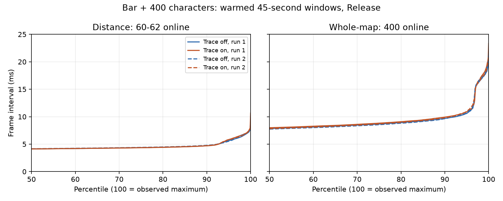

# Per-object switching and activation: Bar, 2026-10-08

Whole-map mode kept server and client representations for all 400 added characters.
It roughly doubled warmed frame time compared with stock distance mode, which kept
only 59–62 of them online. The largest completed whole-map creature switching revisit gap was
64.876 ms; a distance-mode outlier reached 147.808 ms. Server-online to successful
client `net_Spawn` reached 4.497 seconds during
loading/creation. The latter is the next operation to investigate, not evidence that
switching evaluations or NPC decisions themselves took four seconds.

## Workload and evidence

Eight fresh-process Release runs, in the row order of [runs.csv](alife-service-2026-10-08/runs.csv),
used the same Bar save, package, 400 positions, unbounded server creation burst,
15-second settling period and 45-second warmed window. There were two repetitions
of each policy/tracing combination, with order reversed between repetitions.
No builds ran during the captures. Filesystem caches were not flushed. This is a
stationary density fixture with active game AI, not a player route or deterministic
replay: whole-map warmed living counts ranged from 395 to 400; all 400 representations
remained present, including corpses. Distance-mode living count stayed at 400.

Hardware: Ryzen 7 5800X (8 cores/16 threads), 96 GiB RAM, RTX 4090. Effective settings:
3840×2160 windowed, VSync off, no FPS cap, `mtALife=true`, effective switching budget
810 microseconds, server scheduler min/max 1/1 ms, 10 objects per update. Stock distance
policy was used without the fixture's artificial 20-metre distance control. The
initial unlimited switching budget is recorded separately in each full capture.

Package identity: Release source tree `a126678cdd435c52842c6b494c33ae04eb8f29c1`;
executable SHA-256 and seed SHA-256 are repeated in `runs.csv`. The save is the existing
`bar_center` seed. The comparisons were repeated after removing the redundant synchronous eligibility
marker. Subsequent edits only regenerate/report the captured results; the engine
source is unchanged. Raw captures/logs and proprietary saves are
retained locally, not committed. These tables are shareable derived evidence, not a
substitute for the raw event stream when investigating an individual ID.

## Warmed results

All times below are milliseconds. Percentiles use nearest rank within each run;
paired values are repetitions, not confidence intervals.

| Policy / service tracing | Frame p50 | Frame p99 | Largest frame |
|---|---:|---:|---:|
| Distance / off | 4.204 / 4.165 | 7.189 / 7.427 | 11.514 / 11.165 |
| Distance / on | 4.196 / 4.335 | 7.340 / 7.980 | 9.351 / 52.007 |
| Whole-map / off | 8.288 / 8.049 | 18.422 / 18.354 | 21.802 / 24.047 |
| Whole-map / on | 8.521 / 7.809 | 18.898 / 18.117 | 23.193 / 26.855 |

The plot uses the published [quantiles](alife-service-2026-10-08/frame-quantiles.csv);
`plot.py` regenerates it with matplotlib (3.11.2 used here).



| Policy / tracing on | Creature revisit samples | Revisit p50 | Revisit p99 | Completed maximum | Largest unfinished revisit age |
|---|---:|---:|---:|---:|---:|
| Distance r1 | 1,746,837 | 13.280 | 20.424 | 26.553 | 25.706 |
| Distance r2 | 1,589,981 | 14.403 | 24.839 | 147.808 | 28.227 |
| Whole-map r1 | 830,717 | 26.854 | 47.584 | 64.876 | 83.547 |
| Whole-map r2 | 952,040 | 23.790 | 42.775 | 62.661 | 43.470 |

These are switching evaluations, **not tactical AI update/reaction times**. Creature
classification includes the actor and corpses. The all-object evaluation gap is
3 updates at the median and 4–5 at p99; lower frame throughput in whole-map
mode corresponds to longer wall-clock revisits. This does not isolate the cause of
that frame cost. Revisit samples are pooled events, so frequently serviced objects
contribute more samples; worst IDs and unfinished waits are retained separately.

No creature awaited its first evaluation at the warmed boundary. There were 529
unfinished creature revisits at `window_end` in each whole-map capture and 539 in
each distance capture. Distance runs also have five earlier terminated revisit waits
within the window, making 544 rows in that category in total. These are ordinary right-censored waits, not automatically
starvation. Counts, maxima, IDs and termination reasons are in
[unfinished.csv](alife-service-2026-10-08/unfinished.csv); completed metrics, including
full loading/creation windows, are in [metrics.csv](alife-service-2026-10-08/metrics.csv).
Attached non-creature items can have an unfinished first visit without being eligible
for independent switching. Do not count them as starved NPCs.

Paired whole-map median differences (tracing on relative to off) were +2.8% and
−3.0%; distance differences were −0.2% and +4.1%. Two repetitions with
nondeterministic AI and these run-to-run differences cannot isolate a small tracing
effect or establish a universal overhead bound. Frame recording was enabled on both
sides. Dedicated writer CPU time and process memory
were not measured separately. Enabled trace locking/timestamping consumes part of
the existing switching budget, so these revisit values include observer cost.

The distance r2 maximum is retained, not trimmed as noise. Creature 33280/1 waited
147.808 ms from trace time 60.179432 to 60.327240 seconds, spanning four updates.
Frames 12705–12708 took 29.441, 34.161, 32.923 and 51.563 ms. The
[correlated excerpt](alife-service-2026-10-08/distance-outlier.json) includes the
neighboring frame/clock rows. This shows a wall-time delay despite a four-update gap;
it does not attribute the slow frames to switching, rendering, tracing or the OS.
The engine log records no save in that interval. Another frame reached 52.007 ms.

Before the warmed window, every run had a 264.621–299.149-ms frame in the
creation/settling stage. The fixture deliberately creates all 400 server objects
in one callback (`BudgetMs=0`); the next recorded frame interval includes that burst.
This is not a measured ordinary Bar-entry hitch or solely a client-construction cost.
[All frame stages](alife-service-2026-10-08/frame-stages.csv) are published separately
so warmed percentiles do not hide the artificial creation burst. Frame collection
starts after application readiness; loading-screen frame costs are not measured.

## Activation and capture integrity

The full whole-map runs each contain 500 completed creature client activations:
server-online to successful `net_Spawn` p99 is 4.415 / 4.190 seconds and maximum is
4.497 / 4.251 seconds. Loading and the creation burst are included; there are no such
activation samples in the warmed whole-map windows. No unfinished creature client
activation remains at the warmed boundary. Completion precedes callbacks and
ownership notification and does not assert that rendering or AI has run.

All four compared traces passed footer-count/clock validation with zero dropped
events. Whole-map traces contain 3,428,704 / 3,701,470 records (105 / 114 MB decimal);
distance traces contain 7,090,391 / 6,475,815 (233 / 212 MB). More frames produce more
visits and therefore larger files even with fewer online characters. Full-capture
unpaired registered client events were all non-creatures (3,603 / 3,636 whole-map,
1,180 / 1,168 distance). There were also 451 / 451 and 102 / 102 unregistered client
events respectively; their class cannot be inferred from this trace. They remain
reported as unmatched and are not included in paired activation distributions.

Additional completed native checks, all with valid zero-drop traces. The permission
fixture was repeated with the comparison package. Reload, roundtrip and combat
checks used the preceding package with the redundant eligibility marker still
present; their lifecycle/gameplay implementation is unchanged by its removal:

- Whole-map permission fixture: two controlled permission-to-online samples,
  238 and 668 microseconds. These small-workload permission tests do not establish
  distance-crossing latency under density.
- Fresh-process reload of the saved dense run: all 400 saved IDs verified.
- Bar → Garbage → Bar: three separate simulator capture files, with policy checks
  after each arrival. Incarnations are local to each file, not campaign identities.
- Three real attacking dogs: hit/jump fixture passed in Release and full Debug.
  Debug is a correctness run, excluded from performance comparisons.

An earlier memory-only collector exhausted its capacity, and its capture was
rejected. Another exploratory run failed the actor pause/death guard; it was not
used as successful evidence. The final streamed collector and all runs above passed.

## Reproduction and next changes

Build/validate with `cargo xtask validate`. Package the Release output with the
existing runtime manifest procedure. From the checkout root, for each combination:

```powershell
./tools/tests/alife-policy/runtime/Run-RegularValidation.ps1 `
  -InstallRoot <game> -Package <release-package> -Mode whole-map `
  -Count 400 -FrameTimes -ServiceTrace
cargo xtask frame-report <session>/appdata/regular-frames.csv
cargo xtask service-report <session>/appdata/alife-service-<pid>-<serial>.csv
cargo xtask service-report <session>/appdata/alife-service-<pid>-<serial>.csv `
  --frames <session>/appdata/regular-frames.csv
```

Use `distance` for the stock control and omit `-ServiceTrace` for instrumentation-off.
Run in the order in `runs.csv`; keep session.json, game log and raw CSVs. Read
[the event contract](alife-service.md) before interpreting incomplete or unmatched waits.
The published capture IDs identify each source; the reader reports actual warmed
clock bounds (a half-open interval within stage 4). Small boundary differences from
the Lua frame window are intentional. The 400-added-character counts do not include
the map's original population; service metrics include all registered creatures.

The next independent engine change is tracked in [#26](https://github.com/vvsotnikov/OGSR-Engine/issues/26): the **client spawn queue**. First
record queue admission/dequeue and per-creature construction cost, then replace the
fixed one-monster/trader-per-frame allowance with a bounded time budget if those
measurements confirm avoidable queue delay. Preserve parent-before-child handling
and cancellation on destruction, and compare activation tails against frame tails.
Do not simply drain all 400 constructions in one frame. Existing draft #8 targets a
different activation experiment and is not used as a dependency here.

Issue #17 remains open for a known-timestamp distance crossing under density, separate
CPU/memory cost measurements and explicit responsiveness targets for #1. Current
maxima are observations, not acceptable thresholds or guarantees. For #2, planner
service and intention-to-action latency need their own probes when implemented.
